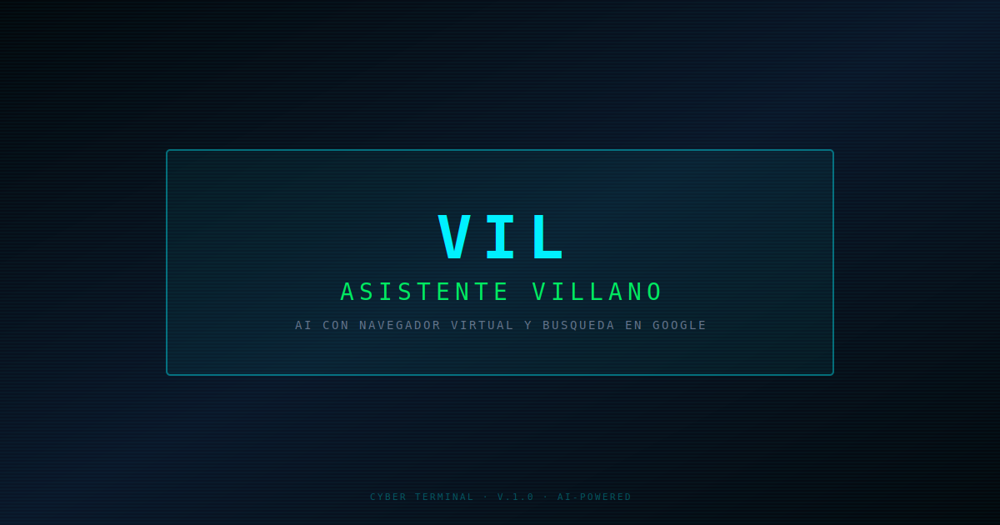

# 👾 E-VIL — Villain Assistant

> AI assistant with villain personality, Google search, cyber-terminal virtual browser and user authentication.

[](https://sentry.io)
[]()
[]()
[](https://sonarcloud.io/summary/new_code?id=Josmaryppirelag17_Vil-Ai-Assitant)
[](https://sonarcloud.io/summary/new_code?id=Josmaryppirelag17_Vil-Ai-Assitant)
[](https://github.com/Josmaryppirelag17/Vil-Ai-Assitant/actions/workflows/ci.yml)
[](https://github.com/Josmaryppirelag17/Vil-Ai-Assitant/actions/workflows/deploy.yml)
[]()
[]()
[]()



---

## 📊 Quality Audits

| Category | Score (Desktop) | Score (Mobile) | Tool |
|---|---|---|---|
| **Performance** | 95/100 | 100/100 | PageSpeed Insights |
| **Accessibility** | 96/100 | 96/100 | PageSpeed Insights |
| **Best Practices** | 100/100 | 100/100 | PageSpeed Insights |
| **SEO** | 100/100 | 100/100 | PageSpeed Insights |
| **Security** | A+ 🏆 | A+ 🏆 | Mozilla Observatory |

> ✅ **Mozilla Observatory**: A+ (115/100 — 10/10 tests passed) — nonce-based CSP.
>
> 🔗 [Mozilla Observatory report](https://developer.mozilla.org/en-US/observatory/analyze?host=vil.josmarypirela.dev)

---

## 🎯 Core Web Vitals (Production - PageSpeed Insights)

### Desktop

| Metric | Value | Rating |
|---|---|---|
| **First Contentful Paint** | 0.2 s | ✅ Good |
| **Largest Contentful Paint** | 0.5 s | ✅ Good |
| **Total Blocking Time** | 20 ms | ✅ Good |
| **Cumulative Layout Shift** | 0.014 | ✅ Good |
| **Speed Index** | 0.8 s | ✅ Good |

### Mobile

| Metric | Value | Rating |
|---|---|---|
| **First Contentful Paint** | 0.9 s | ✅ Good |
| **Largest Contentful Paint** | 2.6 s | ✅ Good |
| **Total Blocking Time** | 10 ms | ✅ Good |
| **Cumulative Layout Shift** | 8.086 | ✅ Good |
| **Speed Index** | 3.0 s | ✅ Good |

> 🔗 [PageSpeed Insights report](https://pagespeed.web.dev/analysis/https-vil-josmarypirela-dev/mhk08ae5ph?form_factor=desktop)
---

## ✨ Features

| Feature | Description |
|---|---|
| **AI Chat** | Interactive terminal with villain personality and contextual responses (Groq) |
| **Web Search** | Grounding with Google Search (Serper.dev) — verifiable results in side panel |
| **Virtual Browser** | Embedded web page viewer with full navigation |
| **Voice & Synthesis** | Speech recognition (Web Speech API), voice selection and speed control |
| **Authentication** | Registration, login, forgot/reset password with bcryptjs, httpOnly cookies and DB sessions |
| **i18n** | Spanish and English with hot-switching (includes auth forms and virtual browser) |
| **Tutorial onboarding** | Interactive cards on first visit with option to revisit |

---

## 🚀 Tech Stack

| Layer | Technology |
|---|---|
| **Framework** | Next.js 16 (App Router) |
| **UI** | React 19 + Tailwind CSS 4 + Framer Motion |
| **Validation** | Zod 4 |
| **Persistence** | Neon (PostgreSQL serverless) + Drizzle ORM |
| **Authentication** | bcryptjs + httpOnly cookies + DB sessions |
| **AI** | Groq API (chat), Serper.dev (Google Search) |
| **Monitoring** | Sentry (errors + performance) |
| **Logger** | Context-scoped structured Logger |
| **Tests** | Vitest (unit) + Playwright (e2e) |
| **Orchestration** | Turborepo |
| **Quality** | TypeScript strict + ESLint core-web-vitals + Prettier + SonarCloud |

---

## 🛠️ Scripts

| Command | Description |
|---|---|
| `pnpm dev` | Start development server |
| `pnpm build` | Build for production (Turborepo with cache) |
| `pnpm test` | Unit tests with coverage (222 tests) |
| `pnpm test:e2e` | End-to-end tests with Playwright |
| `pnpm typecheck` | TypeScript type checking |
| `pnpm lint` | ESLint (flat config) |
| `pnpm preflight` | typecheck + lint + test (CI ready) |
| `pnpm format` | Format code with Prettier |

---

## 🧪 Tests

```bash
pnpm test        # Unit + integration (Vitest) — 222 tests
pnpm test:e2e    # E2E (Playwright)
pnpm preflight   # typecheck + lint + test (CI pipeline)
```

---

## 📁 Architecture

```
src/
├── app/               # App Router (pages, API routes, layout, auth)
│   ├── api/           # chat, search, browser/simulate, auth/*
│   ├── layout.tsx     # Root layout with AuthProvider, i18n, SEO
│   └── page.tsx       # Main page (TerminalConsolePage)
├── components/        # Atomic Design
│   ├── atoms/         # AuthButton, RetroButton, TerminalInput, ParticlesBackground
│   ├── molecules/     # AuthModal, AiAvatar, ChatList, RecommendationsPanel
│   ├── organisms/     # TerminalConsolePage, ChatMessages, SearchResults, VirtualBrowserWindow
│   └── templates/     # SplitLayout (30/70)
├── context/           # AuthContext
├── hooks/             # useChat, useFocusTrap, useSpeechRecognition, useBrowserSimulation
├── infrastructure/    # api/, database/, logger/, storage/
├── lib/               # auth service, groq, rateLimit, db schema, Zod schemas
└── types/             # Shared types
```

---

## 🚦 CI/CD

### GitHub Actions (`.github/workflows/ci.yml` + `.github/workflows/deploy.yml`)

| Job | Commands | Artifacts (only on failure) |
|---|---|---|
| **lint** | `pnpm lint` | — |
| **test** | `pnpm typecheck` → `pnpm test` | `coverage/` |
| **build** | `pnpm build` (needs lint + test) | — |
| **e2e** | `playwright install chromium` → `pnpm test:e2e` (needs build) | `playwright-report/` |
| **deploy-staging** | Build + Vercel Preview (branch `develop`) | — |
| **deploy-prod** | Build + Vercel Production (branch `main`) | — |
| **rollback** | Manual via `workflow_dispatch` | — |

- `pnpm preflight` for pre-push hook
- **Staging**: auto-deploy from `develop` to Vercel Preview
- **Production**: auto-deploy from `main` to Vercel Production
- **Rollback**: manual via GitHub Actions (`workflow_dispatch`)

---

## 🔐 Authentication

The authentication system allows users to register and login to preserve their conversation history across sessions.

| Feature | Detail |
|---|---|
| **Registration** | Name, Last Name, Username, Email, Password + Confirmation |
| **Validations** | Unique email, Unique username (alphanumeric regex), password: 8+ chars, 1 uppercase, 1 number, 1 special |
| **Password checker** | Real-time dynamic checklist with [✓]/[ ] during registration; submit disabled if requirements not met |
| **Forgot password** | "Forgot password?" link in login → `/auth/forgot-password` page with email input |
| **Reset** | API generates token (1h expiration), `/auth/reset-password/[token]` page for new password |
| **Reset security** | All active sessions are invalidated on password reset |
| **Security** | bcryptjs (12 rounds), httpOnly cookies, sessions with 7-day expiration |
| **i18n** | Auth forms, reset pages and virtual browser in Spanish and English |
| **UX** | "SIGN IN / SIGN UP" button in footer + modal with tabs |

---

## 📝 Logger

Structured logger with levels (`debug`, `info`, `warn`, `error`) — silenced in production.

---

## 🔐 Environment Variables

See `.env.example` for required variables.

---

## ♿ Accessibility

| Practice | Implementation |
|---|---|
| **Skip to content** | Skip link to main content in layout |
| **ARIA roles** | Semantic roles (`alert`, `status`, `dialog`, `button`) |
| **Focus management** | Focus trap in modals, visible focus, logical tab order |
| **Reduced motion** | Support for `prefers-reduced-motion: reduce` |
| **Contrast** | Sufficient contrast color palette with high contrast mode |
| **Alternative text** | Decorative icons with `aria-hidden`, external links with `aria-label` |

---

## 📦 Quick Deploy

```bash
pnpm install && pnpm dev      # Development
pnpm build && pnpm start       # Production
```

---

## 🔗 Links

[](https://vil.josmarypirela.dev)
[](https://josmarypirela.dev)

---

## 📜 License

**Code** — This project is licensed under the
[PolyForm Noncommercial 1.0.0](LICENSE).

**Visual identity** — The brand assets, design system, color palette, and logos
are licensed under [CC BY-NC-SA 4.0](assets/brand/LICENSE).

© 2026 [Josmary Pirela](https://josmarypirela.dev)
