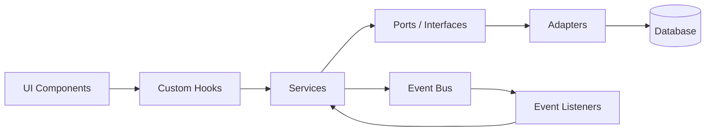
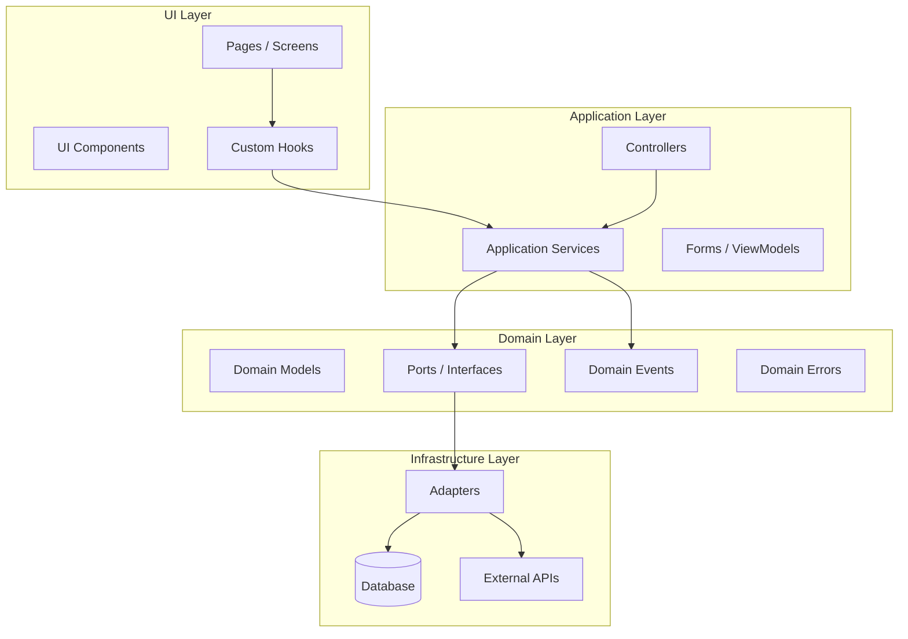

# Architecture

> Generated: 2026-06-09  
> Platform: **Web (Next.js)**  
> Modules: 24

---

## Stack Architecture

### Web (Next.js)

```
┌─────────────────────────────────────────────┐
│                  Browser                     │
├─────────────────────────────────────────────┤
│  React Components → Custom Hooks → Services  │
│         ↓ (API Calls via fetch/axios)         │
├─────────────────────────────────────────────┤
│  Next.js API Routes / Server Components       │
│  Services → Ports → Adapters (Drizzle)        │
│         ↓                                     │
│  PostgreSQL + Drizzle ORM                     │
└─────────────────────────────────────────────┘
```

## Data Flow



## Module Dependencies

```mermaid
graph TD
  M0["src/components/organisms\n[Component]"]
  M1["src/app\n[Module]"]
  M2["src/components/molecules\n[Component]"]
  M3["src/app/api/browser/simulate\n[API Route]"]
  M4["src/app/api/chat\n[API Route]"]
  M5["src/app/api/suggestions\n[API Route]"]
  M6["src/components/atoms\n[Component]"]
  M7["src/core/services\n[Service]"]
  M8["src/hooks\n[Hook]"]
  M9["src/lib\n[Module]"]
  M10["src/app/api/chat/stream\n[API Route]"]
  M11["src/app/api/search\n[API Route]"]
  M12["src/components/templates\n[Component]"]
  M13["src/infrastructure/api\n[Module]"]
  M14["src/lib/db\n[Database]"]
  M15["src/lib/i18n\n[Module]"]
  M16["src/context\n[Module]"]
  M17["src/core/domain\n[Domain Error]"]
  M18["src/core/ports\n[Port]"]
  M19["src/infrastructure/logger\n[Module]"]
  M20["src/infrastructure/storage\n[Module]"]
  M21["src\n[Module]"]
  M22["src/types\n[Module]"]
  M23["src/utils\n[Utility]"]
```



| Module | Kind | Dependencies | Dependents |
|--------|------|--------------|------------|
| `src/components/organisms` | Component | 7 | 0 |
| `src/app` | Module | 4 | 0 |
| `src/components/molecules` | Component | 4 | 0 |
| `src/app/api/browser/simulate` | API Route | 2 | 0 |
| `src/app/api/chat` | API Route | 2 | 0 |
| `src/app/api/suggestions` | API Route | 2 | 0 |
| `src/components/atoms` | Component | 2 | 0 |
| `src/core/services` | Service | 2 | 0 |
| `src/hooks` | Hook | 2 | 0 |
| `src/lib` | Module | 2 | 0 |
| `src/app/api/chat/stream` | API Route | 1 | 0 |
| `src/app/api/search` | API Route | 1 | 0 |
| `src/components/templates` | Component | 1 | 0 |
| `src/infrastructure/api` | Module | 1 | 0 |
| `src/lib/db` | Database | 1 | 0 |
| `src/lib/i18n` | Module | 1 | 0 |
| `src/context` | Module | 0 | 0 |
| `src/core/domain` | Domain Error | 0 | 0 |
| `src/core/ports` | Port | 0 | 0 |
| `src/infrastructure/logger` | Module | 0 | 0 |
| `src/infrastructure/storage` | Module | 0 | 0 |
| `src` | Module | 0 | 0 |
| `src/types` | Module | 0 | 0 |
| `src/utils` | Utility | 0 | 0 |

## Clean Architecture Layers



---

*Generated by generate-docs.ts — 2026-06-09T20:22:24.303Z*
